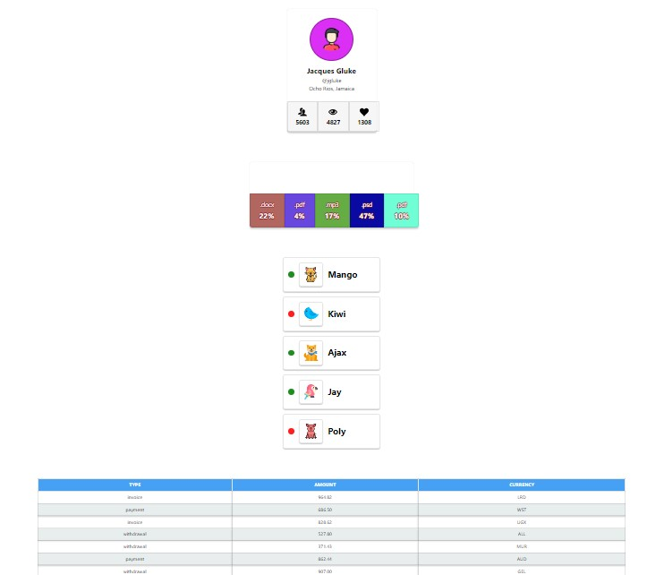

# ℝ𝕖𝕒𝕔𝕥 ℂ𝕠𝕞𝕡𝕠𝕟𝕖𝕟𝕥𝕤  
## 𝔽𝕚𝕣𝕤𝕥 𝕣𝕖𝕒𝕔𝕥 𝕙𝕠𝕞𝕖𝕨𝕠𝕣𝕜



This project was created using [Create React App](https://create-react-app.dev/).  

## 𝔽𝕖𝕒𝕥𝕦𝕣𝕖𝕤 𝕒𝕟𝕕 𝕋𝕖𝕔𝕙𝕟𝕠𝕝𝕠𝕘𝕚𝕖𝕤 ᎓   

</a>&nbsp;
  &nbsp;
  &nbsp;
  &nbsp;
  &nbsp;
  &nbsp;
  &nbsp;
  &nbsp;  
  
  Getting to know the basic foundation of React.

※ @emotion/react and @emotion/styled: Styling library for React components.  
※ prop-types: to define the expected data types.  
※ react-icons: icon library for React applications.  
※ [Axios](https://axios-http.com): HTTP client for database operation.  
※ [MockAPI](https://mockapi.io): Mock API for simulating backend data.  

## 𝕀𝕟𝕤𝕥𝕒𝕝𝕝𝕒𝕥𝕚𝕠𝕟 ᎓  

To get started with this project, follow the installation instructions below.

1. Clone the repository:
   ```bash
   git clone https://github.com/Morifer79/react-components.git
   cd react-components-app
   ```
2. Install the dependencies:
   ```bash
   npm install
   ```
3. Start the development server:
   ```bash
   npm start
   ```
4. Open to view it in the browser:  
<a href="morifer79.github.io/react-components/"></a>

## 𝔼𝕞𝕒𝕚𝕝 𝕞𝕖 ᎓  
Questions, suggestions, help:  
<a href="mailto:cyber-morifer@proton.me"></a>
   
